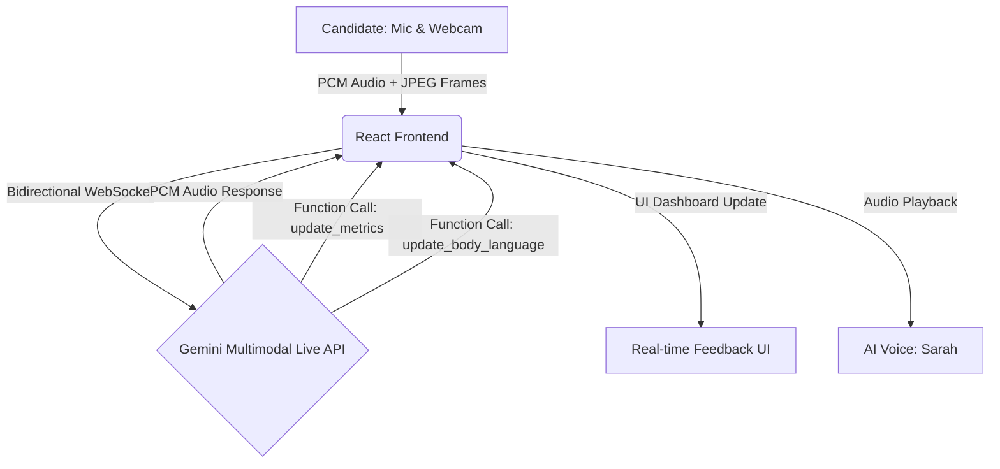

# 🎯 Visionary Recruiter
### *The Next-Generation Multimodal AI Interview Coach*

[](https://github.com/Dhananjay-Sai-Kumar-K/Visionary-Recruiter)
[](https://your-live-demo-link.web.app)
[](https://ai.google.dev/)

Built for the **Google Gemini Live Agent Challenge**, Visionary Recruiter is a state-of-the-art multimodal AI coach that sees, hears, and interacts with you in real-time to simulate high-stakes interviews.

---

## 🛑 The Problem
Traditional interview prep tools rely on static text boxes or pre-recorded videos. They cannot assess your **body language**, they can't interrupt you when you ramble, and they can't dynamically adjust the difficulty of their questions based on your resume or your real-time performance. They fail to simulate the true pressure and nuance of a real interview.

## 💡 The Solution
**Visionary Recruiter** changes the paradigm. By leveraging the **Gemini Multimodal Live API**, it creates an immersive, bidirectional WebSocket connection. 
* **It Hears You:** Processing low-latency PCM audio, it listens to your answers and can naturally interrupt you, just like a real recruiter.
* **It Sees You:** Processing live video frames, it grades your posture, eye contact, and even lets you hold up whiteboard architecture drawings to the camera for technical evaluation.
* **It Coaches You:** Using real-time Function Calling, it updates a live telemetry dashboard grading your "STAR" method structure (Situation, Task, Action, Result) as you speak.

## ✨ Key Features
- **Dynamic Context Injection:** Upload your `.txt` or `.pdf` resume. The AI instantly reads it and bases its first, highly specific question on your actual past experience.
- **Multimodal Whiteboarding:** In the *Technical Dive* track, you can draw a system architecture diagram on paper, hold it up to your webcam, and the AI will "see" it and grade your logic.
- **Real-Time Body Language Metrics:** Tracks your posture and eye contact through the webcam, providing a live 0-100 score.
- **Reverse Q&A Mode:** Click "Wrap Up" to trigger the crucial final interview phase: *"Do you have any questions for me about the company?"*
- **Four Distinct Tracks:** Choose between *HR Screen*, *Behavioral*, *Technical Dive*, or *Stress Test*. The AI's persona, strictness, and system instructions adjust instantly.

## 🏗️ Architecture
Visionary Recruiter is built entirely on the edge, directly connecting the client's browser to Google's AI infrastructure for the lowest possible latency.



## 🛠️ Built With

* **Google Gemini 2.0 Flash (Multimodal Live API)**
* **Google Cloud Services** (Firebase Hosting / Cloud Run for deployment proof)
* **React 18 + TypeScript**
* **Vite + Tailwind CSS**
* **Web Audio API** (Custom AudioWorklets for PCM chunking and VAD noise gating)
* **Framer Motion + Lucide React** (For premium UI/UX)

## 🚀 Setup Instructions

Follow these steps to run Visionary Recruiter locally on your machine.

### Prerequisites
- Node.js (v18+)
- A Google AI Studio API Key ([Get one here](https://aistudio.google.com/app/apikey))

### 1. Clone the repository
```bash
git clone https://github.com/Dhananjay-Sai-Kumar-K/Visionary-Recruiter.git
cd Visionary-Recruiter
```

### 2. Install dependencies
```bash
npm install
```

### 3. Configure the Gemini API Key
You can either input the API key directly in the gorgeous UI when the app launches, or create a `.env` file in the root directory for convenience:
```env
VITE_GEMINI_API_KEY="your_gemini_api_key_here"
```

### 4. Run the development server
```bash
npm run dev
```
Open `http://localhost:5173` in your browser.

## 🔍 Gemini API Integration Proof
The core of the application relies on establishing a WebRTC-style bidirectional stream with the `generativelanguage.googleapis.com` endpoint.

*Code Snippet from `src/hooks/useGeminiLive.ts`:*
```typescript
const url = `wss://generativelanguage.googleapis.com/ws/google.ai.generativelanguage.v1beta.GenerativeService.BidiGenerateContent?key=${apiKey}`;
const ws = new WebSocket(url);

ws.send(JSON.stringify({
    setup: {
        model: "models/gemini-2.5-flash-native-audio-preview-12-2025",
        generation_config: { response_modalities: ["AUDIO"] },
        system_instruction: { /* Persona & Rules */ },
        tools: [{
            function_declarations: [{
                name: "update_interview_metrics",
                description: "Update STAR evaluation scores after each answer.",
                // ... schema definitions
            }]
        }]
    }
}));
```

## ☁️ Google Cloud Proof
*(Replace this section with screenshots of your Firebase Hosting deployment or Cloud Run dashboard before final Devpost submission)*
- Deployed via **Firebase Hosting**.
- Live link: [Insert Link]

## 🏆 Category Selection
**Category: Live Agents**
Because Visionary Recruiter relies entirely on the sub-second, bidirectional, multimodal streaming capabilities of the new Gemini Live API to create an immersive, real-time audio/visual conversation.

---
*Developed by Dhananjay Sai Kumar K.*
