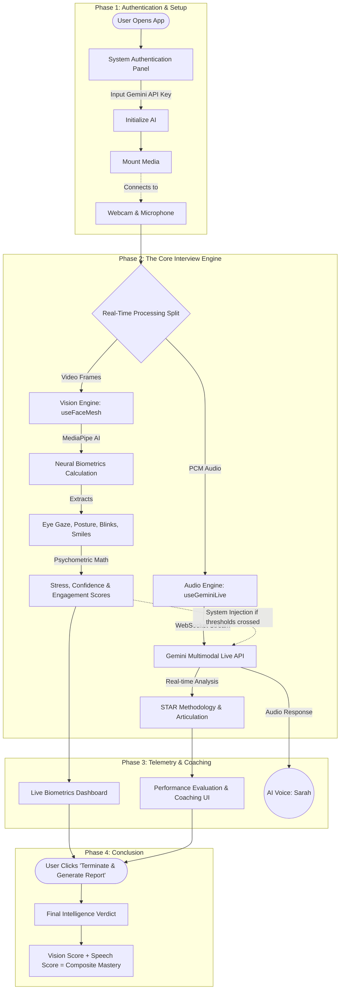

# 🎯 Visionary Recruiter
### *The Next-Generation Multimodal AI Interview Coach*

[](https://github.com/Dhananjay-Sai-Kumar-K/Visionary-Recruiter)
[](https://your-live-demo-link.web.app)
[](https://ai.google.dev/)

Built for the **Google Gemini Live Agent Challenge**, Visionary Recruiter is a state-of-the-art multimodal AI coach that sees, hears, and interacts with you in real-time to simulate high-stakes interviews. 

It has been newly upgraded to a production-grade, research-level behavioral inference architecture.

---

## 🛑 The Problem
Traditional interview prep tools rely on static text boxes or pre-recorded videos. They cannot assess your **body language**, they can't interrupt you when you ramble, and they can't dynamically adjust the difficulty of their questions based on your resume or your real-time performance. They fail to simulate the true pressure and nuance of a real interview.

## 💡 The Solution
**Visionary Recruiter** changes the paradigm. By leveraging the **Gemini Multimodal Live API** fused with local **Computer Vision**, it creates an immersive, bidirectional AI connection that evaluates the *whole* candidate.
*   **It Hears You:** Processing low-latency PCM audio, it listens to your answers and can naturally interrupt you, just like a real recruiter.
*   **It Sees You:** Analyzing live video frames via a local Neural Biometrics engine, it tracks your eye contact, head stability, blink spikes, and micro-expressions safely in the browser.
*   **It Adapts:** Using a "Fusion Loop," if the vision system detects your stress levels spiking, it injects hidden system prompts telling the AI interviewer to dynamically adjust its tone or questioning.

## ✨ Key Features
*   **Neural Biometrics Dashboard:** Live telemetry tracking Executive Presence, Cognitive Stress, Confidence, Gaze Stability, and Authentic Smiles.
*   **STAR Methodology Tracking:** Function calling continuously monitors whether candidate responses successfully follow the Situation, Task, Action, Result framework.
*   **The Fusion Loop:** Automated behavioral triggers. If the vision engine detects low engagement or high anxiety, it seamlessly instructs the Gemini agent to alter its conversation strategy on the fly.
*   **Psychometric Inference Engine:** Sliding-window analytical math models that translate raw camera mesh data into human-readable emotional states.
*   **Final Intelligence Report:** A composite scoring system combining Visual Body Language Scores with Spoken Word Logic Scores for a final hiring verdict.

## 🏗️ Architecture & Flowchart

The application relies entirely on the edge, creating a direct bridge between the client's local processing and Google's low-latency AI infrastructure. 



## 🚶 User Journey & Module Interaction
*This flow mimics the exact experience a user encounters from start to finish, explaining what powers each step of the journey.*

### 1. System Authentication & Setup
*   **The UI Module:** The user begins by providing their Gemini API key in the authentication box.
*   **The Engine Activation:** Clicking "Initialize AI" and "Mount Media" triggers the `useGeminiLive.ts` hook, establishing a `wss://` WebSocket connection to Google Cloud. Simultaneously, the `useFaceMesh.ts` vision module asks for webcam permissions and spins up the local MediaPipe neural network.

### 2. The Live Interview (Dual Processing)
Once the stream connects, the user experiences a simulated video call. Behind the scenes, the stream is split into two specialized engines:
*   **The Vision Engine (`useFaceMesh.ts`):** Runs tightly-optimized computer vision in the browser. It maps 478 3D facial landmarks from the webcam. It doesn't just track faces; it uses complex sliding-window logic to compute blink frequency, gaze stability, and head posture, wrapping these into human scores (Cognitive Stress, Executive Presence).
*   **The Audio Engine (`useGeminiLive.ts`):** Batches 16kHz PCM audio and sends it over the WebSocket. The user clicks and holds the "Hold to Interact" button to speak. Gemini 2.0 Flash instantly transcribes the speech and replies naturally using its multimodal voice.

### 3. The Fusion Loop (Invisible Adaptations)
*   **The Sync Module (`App.tsx` Logic):** As the user speaks, the app monitors their biometrics. If they look away from the camera for too long (Engagement drops < 40%) or their blink rate spikes erratically (Stress > 68%), the app silently generates a **System Injection**. This text prompt flies directly into Gemini's context window, alerting it: *"Biometric alert: Candidate stress high. Consider a supportive pause."* The AI automatically shifts its conversational tone, creating a terrifyingly realistic simulation.

### 4. Telemetry Visualization
*   **The UI Cards:** As the user breathes and talks, the interface pulses dynamically. The **Neural Biometrics Dashboard** updates sub-second tracking micro-expressions. Meanwhile, the **Performance Evaluation UI** updates via Gemini Function Calling, lighting up as the user completes portions of the "STAR" methodology (Situation, Task, Action, Result) in their verbal responses.

### 5. Final Verdict Generation
*   **The Conclusion Engine:** When the candidate clicks "Terminate & Generate Report", all WebRTC and video streams are severed to ensure privacy. The system aggregates all scores. It relies 45% on the Vision Biometrics score (body language) and 55% on the AI's Speech Logic score (articulation) to produce a single **Composite Mastery Score** and final AI written feedback, ready to be exported.

---

## 🛠️ Built With

*   **Google Gemini 2.0 Flash (Multimodal Live API)**
*   **MediaPipe Vision** (For local client-side biometric tracking)
*   **React 18 + TypeScript**
*   **Vite + Tailwind CSS**
*   **Web Audio API** (Custom AudioWorklets for PCM chunking and VAD noise gating)
*   **Framer Motion** (For premium UI/UX)

## 🚀 Setup Instructions

Follow these steps to run Visionary Recruiter locally on your machine.

### Prerequisites
- Node.js (v18+)
- A Google AI Studio API Key ([Get one here](https://aistudio.google.com/app/apikey))

### 1. Clone the repository
```bash
git clone https://github.com/Dhananjay-Sai-Kumar-K/Visionary-Recruiter.git
cd Visionary-Recruiter
```

### 2. Install dependencies
```bash
npm install
```

### 3. Configure the Gemini API Key
You can either input the API key directly in the UI when the app launches, or create a `.env` file in the root directory for convenience:
```env
VITE_GEMINI_API_KEY="your_gemini_api_key_here"
```

### 4. Run the development server
```bash
npm run dev
```
Open `http://localhost:5173` in your browser.

## 🔍 Gemini API Integration Proof
The core of the application relies on establishing a WebRTC-style bidirectional stream with the `generativelanguage.googleapis.com` endpoint.

*Code Snippet from `src/hooks/useGeminiLive.ts`:*
```typescript
const url = `wss://generativelanguage.googleapis.com/ws/google.ai.generativelanguage.v1beta.GenerativeService.BidiGenerateContent?key=${apiKey}`;
const ws = new WebSocket(url);

ws.send(JSON.stringify({
    setup: {
        model: "models/gemini-2.5-flash-native-audio-latest",
        generation_config: { response_modalities: ["AUDIO"] },
        system_instruction: { /* Persona & Rules */ },
        tools: [{
            function_declarations: [{
                name: "update_interview_metrics",
                description: "Update STAR evaluation scores after each answer.",
                // ... schema definitions
            }]
        }]
    }
}));
```

## 🏆 Category Selection
**Category: Live Agents**
Because Visionary Recruiter relies entirely on the sub-second, bidirectional, multimodal streaming capabilities of the new Gemini Live API fused with real-time biometric tracking to create an immersive, dynamic audio/visual conversational simulation.

---
*Developed by Dhananjay Sai Kumar K.*
